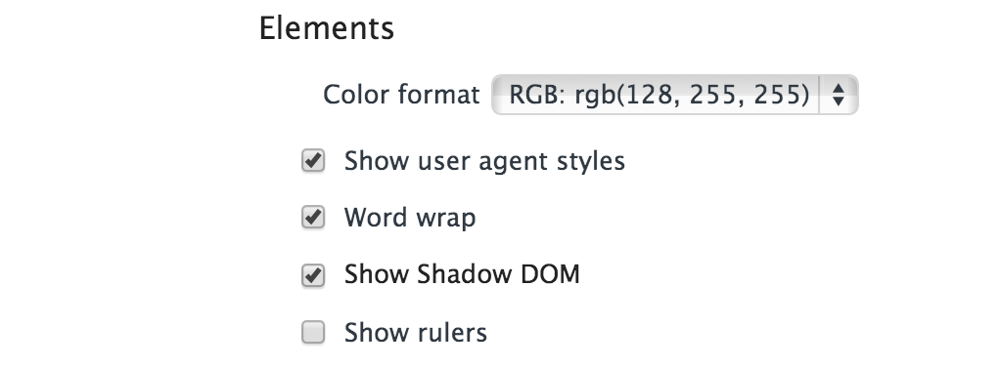

# Shadow DOM
### Huh? What?

## Regular DOM Node

```html
<h1>Hello World</h1>
```

## Why do we *need* Shadow DOM?

## HTML/CSS/JS is a platform for everything
### Documents
### Apps
### Games
### etc

## Flexibility is important
## DOM provides a lot of useful stuff

# Problem #1: Modifying Native Elements Sucks

## Current Solution
### Rebuild everything

## Rebuild everything in
### DOM?
### Canvas?
### SVG?

## Rebuilding native element styles sucks
### Cross platform
### Updates e.g. iOS6 vs iOS7?

## Uncanny Valley

## Particularly bad for mobile web
### People expect visual unity on mobile

## Rebuilding native element behaviour sucks
### Keyboard/touch shortcuts
### Cross platform
### Updates e.g. iOS6 vs iOS7?

## Particularly bad for desktop web
### People expect functional unity on desktop
### Accessibility!

## Frustrated Users


## Libraries
### jQuery Mobile
### jQTouch
### Titanium
### Blossom.io

## Libraries suck
### Code Bloat
### Artificial Limitations
### Complexity
### Less Control 

## Consistent Experience
### Some websites need custom UI
### Many Apps need custom UI
### Most Games need custom UI

# Problem #2: The semantic web is hard to style

## Semantic web
### Remember CSS vs Tables?

## Semantic web: Decouple content from presentation.

## Are divs really 'semantic'?

```html
<div class="header">...</div>
<div class="main">...</div>
<div class="footer">...</div>
```

## divs + class abuse is about as good as we get in HTML4

```html
<div class="header">...</div>
<div class="main">...</div>
<div class="footer">...</div>
```

## Semantics go out the window when faced with certain styling issues

* * * 

```html
<div class="page-wrapper">
  <div class="header">
    <div class="wrapper">
    ...
    </div>
  </div>
  <div class="main">
    <div class="wrapper">...</div>
  </div>
  <div class="footer">
    <div class="wrapper">
      <div class="wrapper-inner">
        ...
      </div>
    </div>
  </div>
</div>
```


## HTML5 makes naming logical sections more semantic

* * * 

### HTML4
```html
<div class="header">...</div>
<div class="main">...</div>
<div class="footer">...</div>
```

### HTML5
```html
<header>...</header>
<main>...</main>
<footer>...</footer>
```

## Even HTML5 cannot save you from layout in CSS

* * * 

```html
<div class="page-wrapper">
  <header>
    <div class="wrapper">
    ...
    </div>
  </header>
  <main>
    <div class="wrapper">...</div>
  </main>
  <footer>
    <div class="wrapper">
      <div class="wrapper-inner">
        ...
      </div>
    </div>
  </footer>
</div>
```

## CSS3 to the rescue

```html
<!-- clearfix the old way -->
<main>...</main>
<div class="clearfix"></div>
```

```css
/* clearfix the new way */
/* welcome pseudo-elements */
main::after {
  content: " ";
  clear: both;
}
/* no additional div required */
```

## Pseudo-elements provide some relief

* Clear floats
* Create styled tooltips
* Apply typographic flourishes
* Give you multiple background canvases
* Style the numbers in ordered lists
* Create an entire icon set
* etc

[http://css-tricks.com/pseudo-element-roundup/](http://css-tricks.com/pseudo-element-roundup/)

## Pseudo-elements not the answer though
### Still not easy to use to describe complex layouts
### Not easy to read
### Not easy to nest
### Indirect way of describing a DOM

# Shadow DOM Solves everything

## Shadow DOM allows you to
#### Tap into and modify native styling/behaviour
#### 
#### Encapsulation


## Enable Shadow DOM in Chrome Inspector

